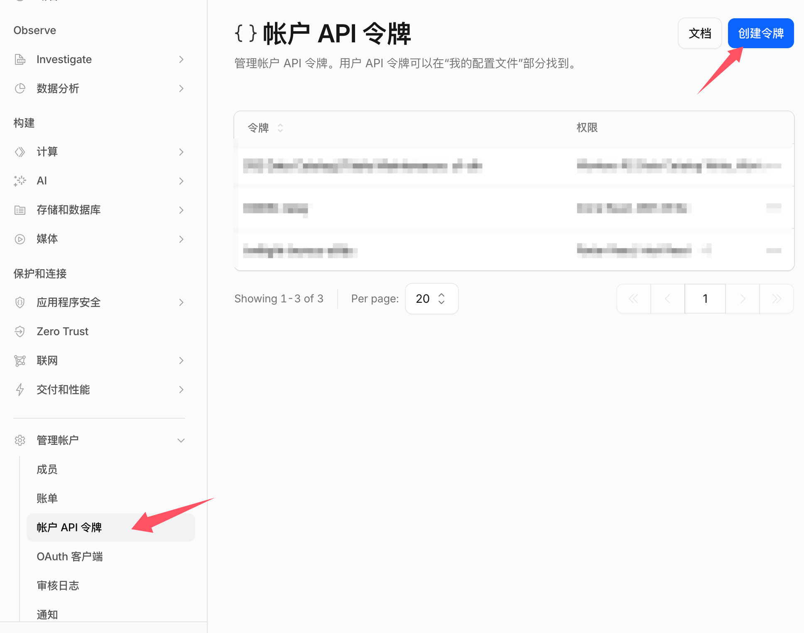
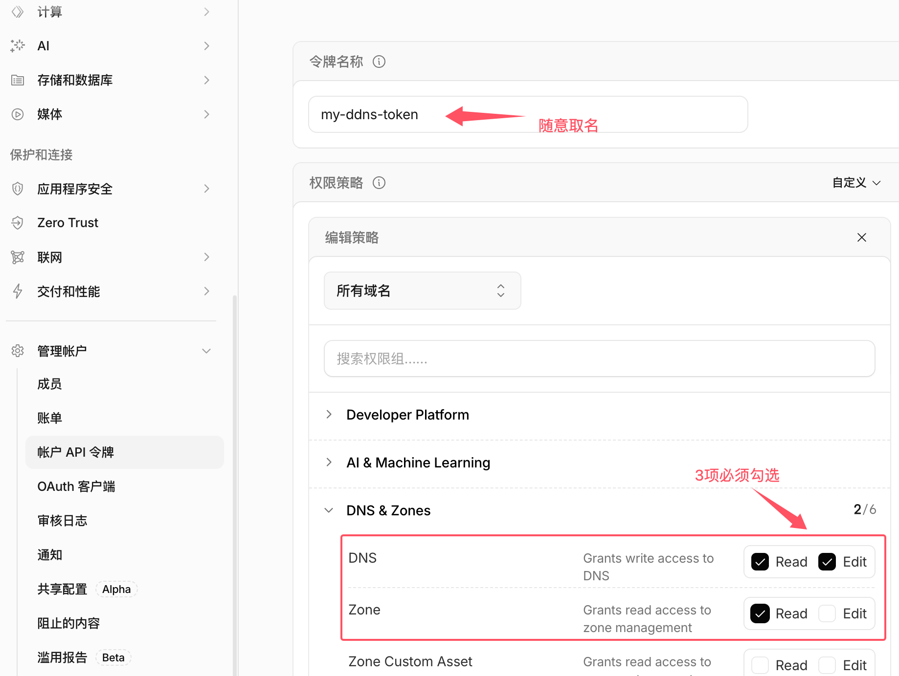

# ddns-relay

> 基于 Cloudflare Worker 的零成本、多域名 DDNS 中继服务。

## 这是什么

> **⚠️ 前置要求**：要使用本项目，**你的域名必须托管在 Cloudflare (CF)**。
> - 如果你的域名**本身就是在 CF 购买的**，那没有任何问题，直接使用即可。
> - 如果你的域名是**在其他服务商（如阿里云、腾讯云、GoDaddy 等）购买的**，也可以免费托管在 CF：只需在原购买处将域名的 DNS 服务器（Name Servers）修改为 CF 提供的 DNS 即可。

家用宽带的动态公网 IP，要解析到固定域名。传统做法是在家里的机器上放一份 CF API Token，定时调 CF API 更新。这个方案有两个缺点：

- Token 一旦泄露，整个 zone 都能被改
- 多台设备需要分别配置 Token

本项目把 Token 放进 Cloudflare Worker（由 CF 加密托管），家里只需要一个**只能操作白名单域名**的 secret。

> **💡 拓展场景**：这套方案**不仅适用于家庭宽带 DDNS**。对于云服务器（VPS），每次开通新机器或更换 IP 时，只需在机器上跑一次上述的 `curl` 命令，就能瞬间自动完成域名 A 记录的创建与绑定，再也不用手动登录域名管理控制台配置解析了！

```
家里设备 ──(HTTPS + secret)──> CF Worker ──(CF API Token)──> 你的 DNS Zone
 (curl)                            │
                                   ├─ ALLOWED_DOMAINS 白名单
                                   └─ zone_id 自动反查
```

## 核心特性

- 🔐 **API Token 不下放**：Token 仅存在 Worker 加密环境变量
- 🛡️ **域名白名单**：`ALLOWED_DOMAINS` 限定可被更新的域名，泄露 secret 也只能操作白名单内域名
- ⚙️ **零配置 zone**：zone_id 由 Worker 自动反查并缓存，用户只需配置域名列表
- 🌐 **多域名 + 多 zone**：一个 Worker 自动支持单个 CF 账号下任意 zone 的任意子域名
- 🤖 **自动获取 IP**：Worker 从 `CF-Connecting-IP` 自动读取，客户端无需 curl 外部 IP 服务
- 🔀 **IPv4 / IPv6 自适应**：根据 IP 形态自动选择 A / AAAA 记录类型
- 💰 **零成本**：Cloudflare Worker 免费版 10 万次/天，远超 DDNS 需求

## 部署步骤

### 1. 准备 CF API Token

1. 登录 Cloudflare Dashboard
2. 左侧 管理账户 → **账户API令牌** → **创建令牌**
3. 选择模板 **"DNS & Zones"**
4. DNS 勾选 `Read`、`Edit`，Zone 勾选 `Read`
5. 保存 Token，只显示一次并妥善保存。



### 2. 生成 SHARED_SECRET

生成一串字符串作为凭证，后续 Worker 和客户端都要用到：
```bash
# 推荐做法：生成 32 位高熵字符串
openssl rand -hex 32
```
> **提示**：这里并没有强制要求必须是 32 位，如果你不考虑安全性，甚至随便输入 `123` 也是可以的，**但一定要妥善保存下来**，因为客户端调用时必须与 Worker 配置的完全一致。

### 3. 部署 Worker

**使用 Wrangler CLI（推荐，需要node支持）：**
```bash
cd worker/
npx wrangler login
npx wrangler deploy
npx wrangler secret put CF_API_TOKEN     # 粘贴步骤 1 生成的 Token
npx wrangler secret put SHARED_SECRET    # 粘贴步骤 2 生成的 secret
```
或直接在 Cloudflare Dashboard 中创建一个 Worker，清空默认代码并粘贴 `worker/worker.js` 的完整代码。

### 4. 配置环境变量

在 Worker `Settings → Variables and Secrets` 设置：

| 变量名 | 类型 | 值 |
|---|---|---|
| `CF_API_TOKEN` | Secret（加密） | CF API Token（`Zone:DNS:Edit` + `Zone:Zone:Read`） |
| `SHARED_SECRET` | Secret（加密） | 客户端共享 secret |
| `ALLOWED_DOMAINS` | Plaintext（明文） | `["home.example.com","nas.example.com"]`（格式必须为 JSON 数组） |

> ⚠ **注意**：`ALLOWED_DOMAINS` 必须是一行无换行的 JSON 数组。配置后 Worker 会自动重新部署并生效。不需要在 CF Dashboard 预建 A 记录，首次调用会自动创建。

---

## 客户端配置 (直接使用 curl)

完全抛弃复杂的客户端脚本，直接利用系统自带的 `curl` 加上 `cron` 即可完成定时更新。

### Linux / macOS / OpenWrt 路由器

使用 `crontab -e` 增加定时任务（每 5 分钟执行一次）：

**基础更新（使用白名单默认域名与当前网络 IP）：**
```bash
*/5 * * * * curl --connect-timeout 5 --max-time 10 -X POST "https://ddns-relay.your-subdomain.workers.dev" -H "X-DDNS-Secret: 你的_SHARED_SECRET" >/dev/null 2>&1
```

**指定特定域名并区分 IPv4 / IPv6：**
```bash
# 强制使用 IPv4 更新 A 记录
*/5 * * * * curl -4 --connect-timeout 5 --max-time 10 -X POST "https://ddns-relay.your-subdomain.workers.dev?name=home.example.com" -H "X-DDNS-Secret: 你的_SHARED_SECRET" >/dev/null 2>&1

# 强制使用 IPv6 更新 AAAA 记录
*/5 * * * * curl -6 --connect-timeout 5 --max-time 10 -X POST "https://ddns-relay.your-subdomain.workers.dev?name=home.example.com" -H "X-DDNS-Secret: 你的_SHARED_SECRET" >/dev/null 2>&1
```

### Windows

可使用 PowerShell 的 `Invoke-RestMethod` 结合“任务计划程序”运行，或在 WSL/Git Bash 中直接运行上述 `curl`。

```powershell
$Url = "https://ddns-relay.your-subdomain.workers.dev?name=home.example.com"
Invoke-RestMethod -Uri $Url -Method Post -Headers @{ "X-DDNS-Secret" = "你的_SHARED_SECRET" }
```

---

## API 参考

**请求端点：**
```
POST  https://<worker-url>/
GET   https://<worker-url>/      (兼容简单场景)
```

**请求参数：**

| 参数 | 必填 | 类型 | 说明 |
|---|---|---|---|
| `name` | 否 | string | 要更新的完整域名（Query参数）；不传则使用 `ALLOWED_DOMAINS` 的首个域名 |
| `ip` | 否 | string | 显式 IP（Query参数）；不传则使用 Worker 自动获取的 `CF-Connecting-IP` |
| `secret`| 是 | string | 可通过 Header `X-DDNS-Secret` 或 Query参数 `?secret=` 传递 |

**调用示例：**

1. **仅指定域名，自动获取 IP (POST)**
```bash
curl -X POST "https://ddns-relay.your-subdomain.workers.dev?name=nas.example.com" \
     -H "X-DDNS-Secret: 你的_SHARED_SECRET"
```

2. **同时指定域名和明确的 IP (POST)**
```bash
curl -X POST "https://ddns-relay.your-subdomain.workers.dev?name=nas.example.com&ip=1.2.3.4" \
     -H "X-DDNS-Secret: 你的_SHARED_SECRET"
```

3. **使用 GET 请求 (适合不支持 POST 的简单客户端)**
```bash
curl -G "https://ddns-relay.your-subdomain.workers.dev?name=nas.example.com" \
     -H "X-DDNS-Secret: 你的_SHARED_SECRET"
```
*(注：如果某些受限环境连 Header 都不支持自定义，也可以将 Secret 放在 URL 参数中直接请求：`...&secret=你的_SHARED_SECRET`)*

**成功响应示例：**
```json
{
  "ok": true,
  "action": "updated",
  "name": "home.example.com",
  "type": "A",
  "ip": "1.2.3.4",
  "zone": "example.com",
  "previous_ip": "1.2.3.0"
}
```

---

## 架构与安全设计

### 数据流安全边界

| 数据 | 存储位置 |
|---|---|
| CF API Token | ✅ 仅 Worker 加密环境变量，客户端不接触 |
| SHARED_SECRET | ✅ Worker 加密环境变量 + 客户端定时任务 |
| ALLOWED_DOMAINS | ✅ Worker 明文环境变量，限制操作范围 |
| zone_id 缓存 | ⚠ Worker isolate 内存（非敏感） |

家庭客户端**永远不接触 CF API Token**。Worker 对 `ALLOWED_DOMAINS` 进行严格精确匹配（非通配符正则），即使攻击者拿到 SHARED_SECRET，也只能修改白名单内的域名。

### zone_id 自动反查与缓存

- Worker 会从传入的域名（FQDN）逐级剥离子域，自动通过 CF API 反查 zone_id。
- 反查成功后会缓存在 Worker isolate 内存中，后续相同 zone 的域名更新无需再次调用查询 API，提升性能并节约 API 次数。

---

## 运维与故障排查

### 常见操作

- **新增域名**：只需在 Worker `ALLOWED_DOMAINS` 中加入新域名并保存即可，客户端直接请求，Worker 会自动查 zone 和创建记录。
- **轮换 Secret**：修改 Worker 的 `SHARED_SECRET` 环境变量，同时更新家中 cron 脚本。旧 Secret 即时失效。
- **查看日志**：进入 Worker Dashboard -> **Logs** -> **Begin log stream** 即可查看实时请求情况。

### 常见错误码

| 状态码 | 含义 |
|---|---|
| 200 | 操作成功（含 unchanged） |
| 400 | 请求参数错误（如：显式 IP 不合法） |
| 401 | secret 错误或缺失 |
| 403 | 域名不在 `ALLOWED_DOMAINS` 白名单中 |
| 500 | Worker 配置错误（通常是 `ALLOWED_DOMAINS` JSON 格式不正确） |
| 502 | CF API 调用失败（如 Token 权限不足，或 zone 反查失败） |

### 故障排查

1. **客户端超时**：检查本地网络是否能正常访问。
   > **⚠️ 重要提示**：Cloudflare 默认分配的 `*.workers.dev` 域名在中国大陆地区由于 DNS 污染等原因，通常无法正常访问。为了保证稳定使用，**强烈建议在 CF Dashboard 中为 Worker 绑定一个托管在 Cloudflare 上的自定义域名 (Custom Domain)**。
2. **502 反查失败**：确保 CF API Token 配置了 `Zone:Zone:Read` 权限，且该域名所在的 zone 已包含在 Token 允许的资源范围内。
3. **401/403 错误**：检查 Header 中的 Secret 拼写，并确保请求的域名与 `ALLOWED_DOMAINS` 中的字符串**完全一致**。

## License

MIT
